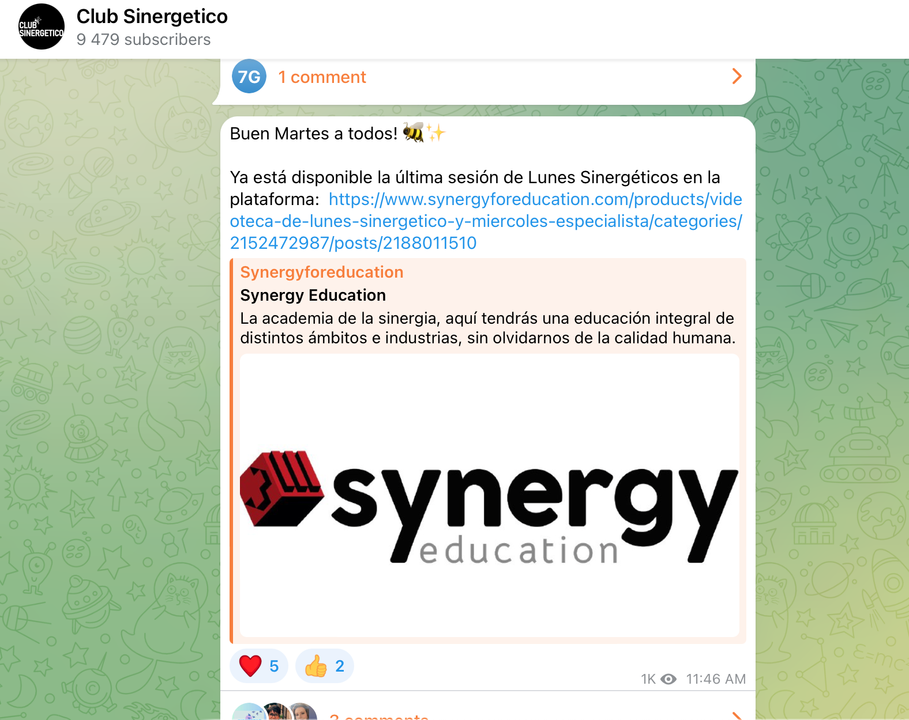
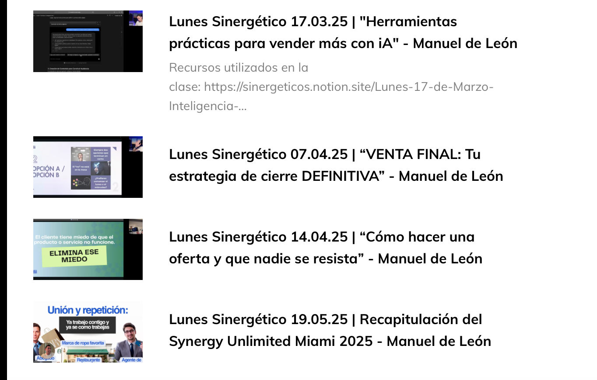
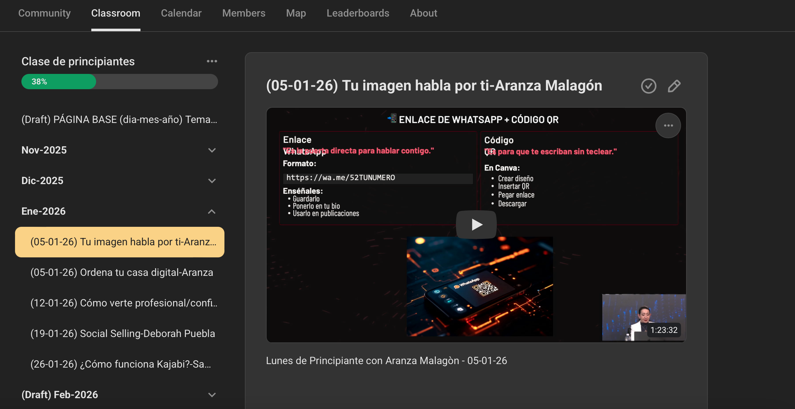

# ¿Cómo encuentro la clase que perdí?

En Telegram se comparte el enlace de la clase al día siguiente de que se impartió

 En la plataforma las pueden encontrar en la Videoteca

*Se encuentran acomodadas por:
-Día de mentoria 
-Fecha
-Tema
-Ponente

Kajabi  Lunes Sinergético

Skool  Módulo Principiantes