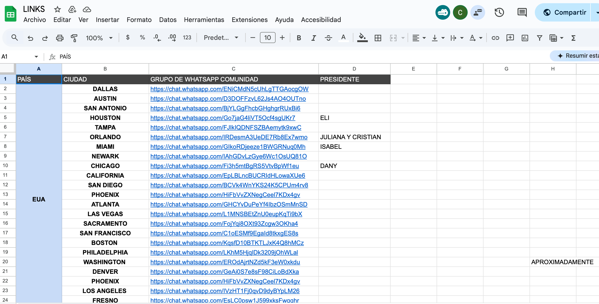

# ¿Cómo ingreso a mi comunidad?

Respuesta 1: Si fue cliente de evento presencial se le compartió en los mensajes de bienvenida por WhatsApp 

Respuesta 2: Si fue de webinar solicitarle la ciudad en la que radica y ver si tenemos comunidad en esa ciudad o en determinado caso seleccionar la más cercana a su ciudad.

NOTAS: 
-Los miembros no pueden estar en más de una comunidad
-El acceso solo se otorga al titular de la membresía

Puedes revisar las comunidades existentes y sus enlaces en el Excel llamado “Links” en la pestaña “Grupos Comunidad”

****NOTA: Todas las solicitudes a comunidades deben ser aprobadas por un agente de soporte.***