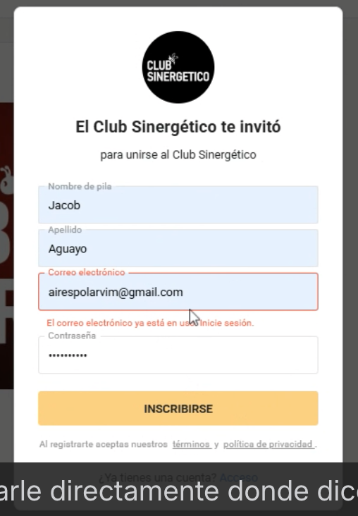
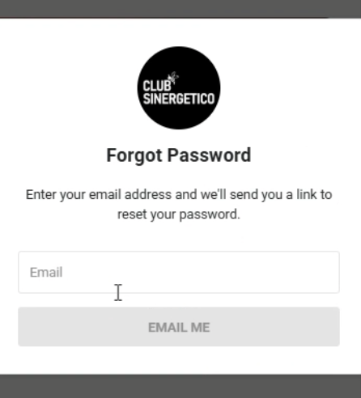

# Me aparece correo en  uso  Skool

Respuesta: A veces falla y aparece así, sin embargo es muy sencillo el protocolo para obtener el acceso con ese correo 

1. En la parte inferior viene una opción que dice “Haz olvidado tu contraseña” “Forgot password”

1. Poner nuevamente el correo 
2. Oprimir el botón que dice mandarme un email para cambiar la contraseña
3. Seguir los pasos 

Link a video tutorial- Mandarselo al cliente con el siguiente mensaje

Entiendo, te comparto un tutorial para que puedas recuperar tu cuenta, velo con detenimiento por favor 🚀:

[https://www.loom.com/share/681dc4dd8a3948f2bd92dd7ca3144c21](https://www.loom.com/share/681dc4dd8a3948f2bd92dd7ca3144c21)