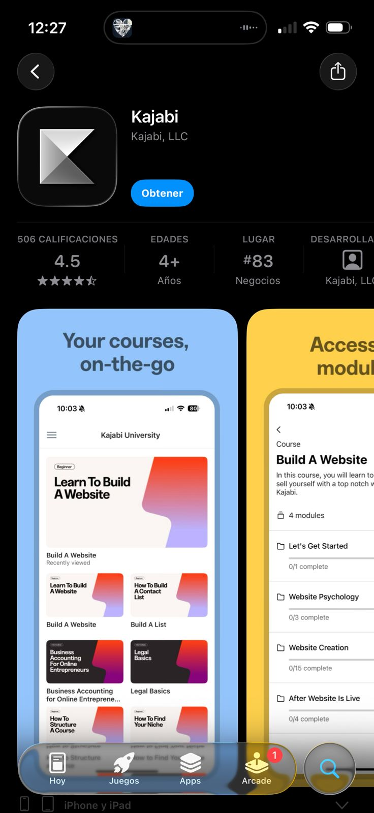
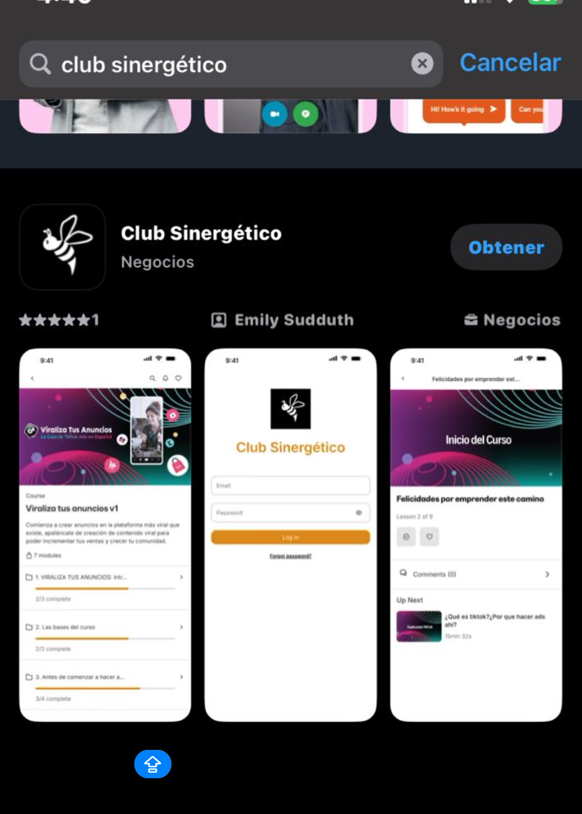

# No encuentro la app Kajabi

Muchas veces los miembros buscan la app que se llama Club Sinergético (IOS)  pero en android solo la pueden encontrar como Kajabi 

Sistema Android. [https://play.google.com/store/apps/details?id=kajabi.kajabiapp](https://play.google.com/store/apps/details?id=kajabi.kajabiapp)

Sistema IOS. [https://apps.apple.com/mx/app/kajabi/id1485646310?l=en](https://apps.apple.com/mx/app/kajabi/id1485646310?l=en)

NOTA: Solo es descargable la app en celulares desde la pc hay que entrar directamente al enlace 

[https://www.synergyforeducation.com](https://www.synergyforeducation.com/)

***OJO: Si ya tenían cursos previos y solo ingresan a la app no les va a aparecer el del club, necesitan borrar y descargar de nuevo la app para que les cargue***

