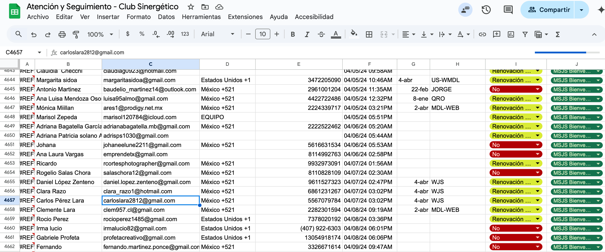
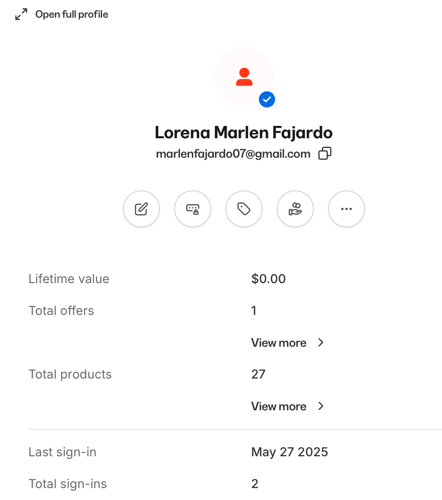
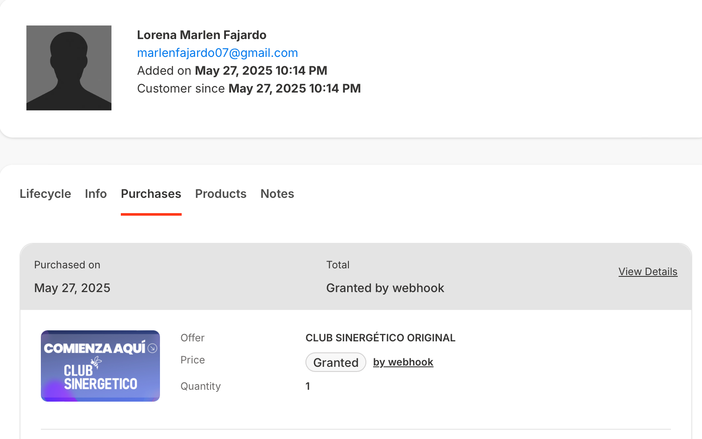
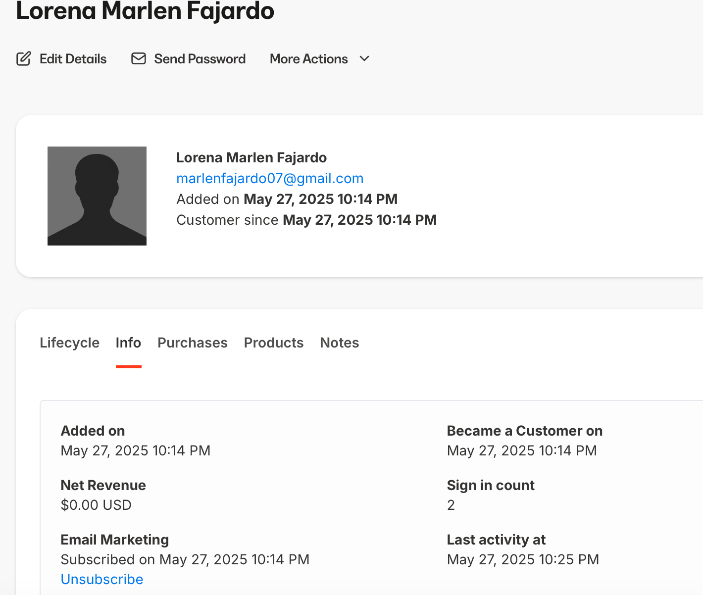
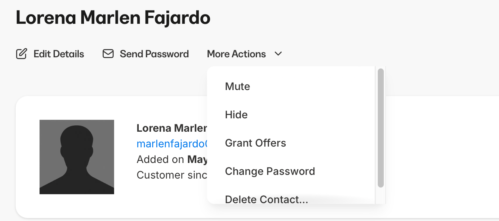

# No tengo acceso a la plataforma

Respuesta 1: Preguntar cuál correo registro y cotejarlo con el excel de atención y seguimiento 

Respuesta 2: Revisar el correo en kajabi y ver si cuenta con acceso

*Si tiene productos significa que tiene acceso

- En purchases ver que producto tiene vigente

Respuesta 3: Revisar vigencia de la membresía puede que haya cumplido el tiempo de su anualidad y el acceso se encuentre revocado por el sistema 

*Se ingresa al perfil y se revisa en la sección “Info”

Respuesta 4: Ingresar a su plataforma y generarles una contraseña ya que hay clientes que la perdieron y no saben como generar una nueva

*Se ingresa al perfil y se modifica en Change Password

