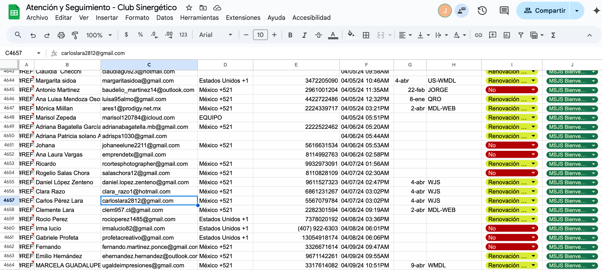
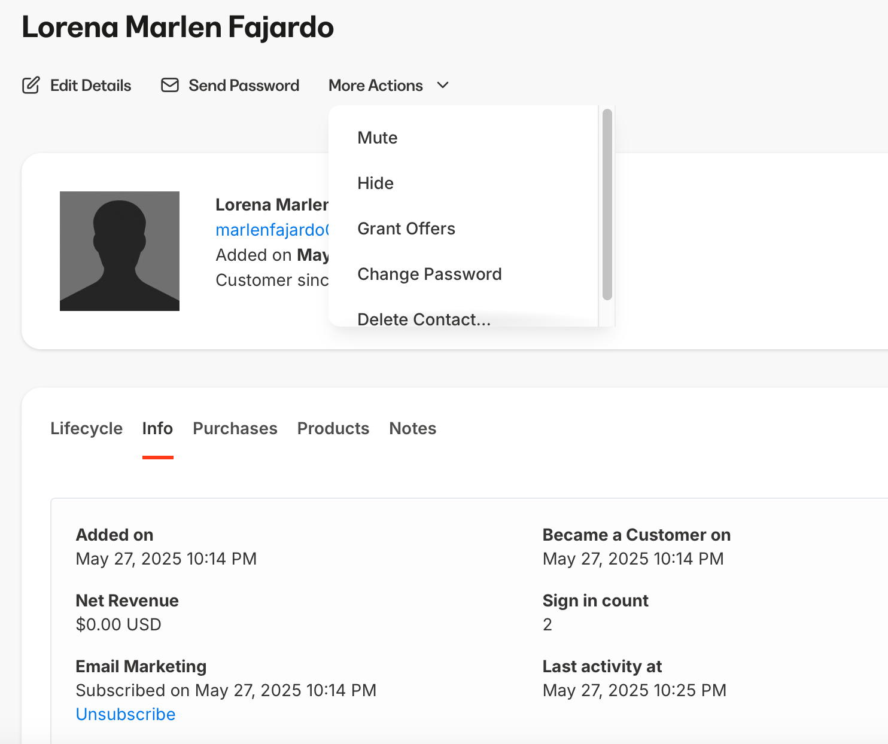

# No tengo mi contraseña

Paso 1: Preguntar cual correo registro y cotejarlo con el excel de atención y seguimiento 

Paso 2: Buscar correo en kajabi y generar una nueva contraseña

NOTA: La contraseña que ponemos a los clientes siempre es la misma para todos y es “123456789” de ese modo si un cliente dice que ya le habían cambiado la contraseña sepamos siempre cual puso el otro agente