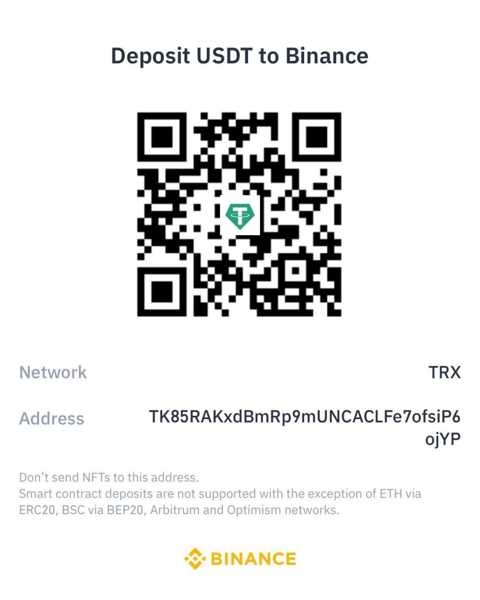

# Aceptamos Cripto

### ¿Qué es Binance?

- Es un **exchange** o casa de cambio de criptomonedas, fundada en 2017.
- Permite operar con más de **400 criptos** (como Bitcoin, Ethereum, Solana, BNB, etc.).
- Tiene servicios tanto para **usuarios individuales** como para empresas e instituciones financieras.
- Su token nativo es **BNB (Binance Coin)**, que se puede usar para pagar comisiones con descuento.