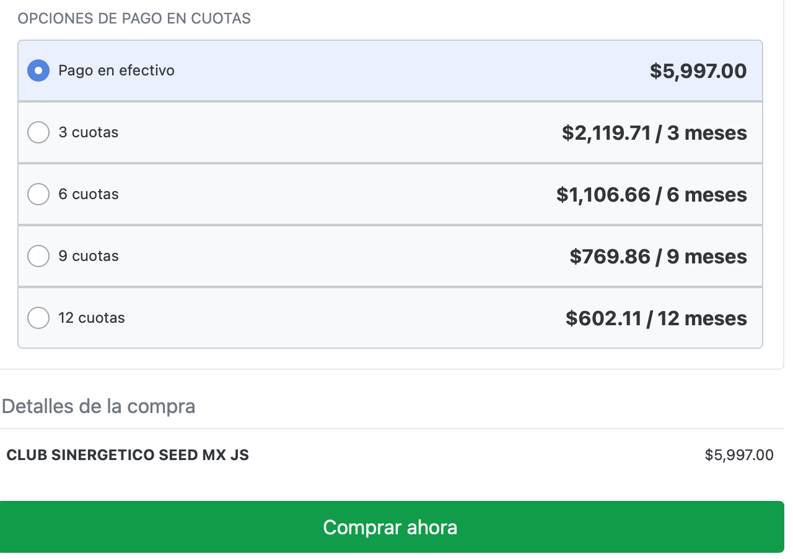

# Me cobraron de más

Los clientes reciben el costo del Club Sinergético con el precio de contado sin embargo si ellos eligen parcializar con las plataformas de pago (México y Latam) el costo incrementa dependiendo los meses seleccionados.

***NOTA: Hotmart le da una previsualización del monto que pagaran al mes por la cantidad de meses que desean seleccionar sin embargo muchas veces la gente no calcula el monto final que terminarán pagando***

Respuesta: Explicar al cliente lo anterior y ofrecer que si desea el precio de contado puede volver a pagar y respetamos ese precio o mantiene su parcialización con el monto actual que le aparece en su banco

Ejemplo de previsualización de pago a meses hotmart

