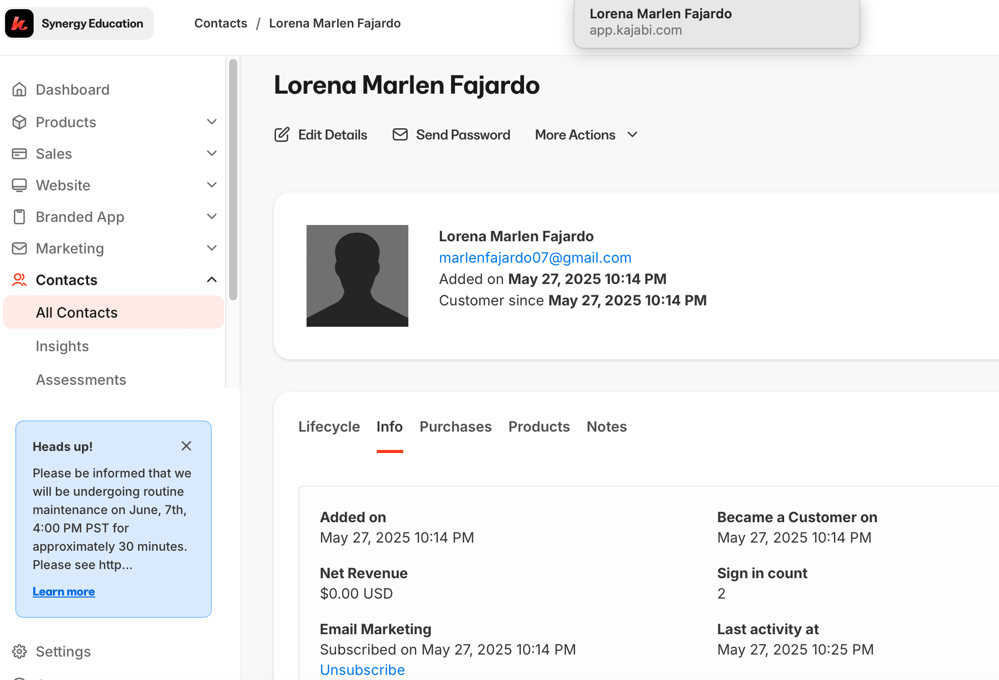
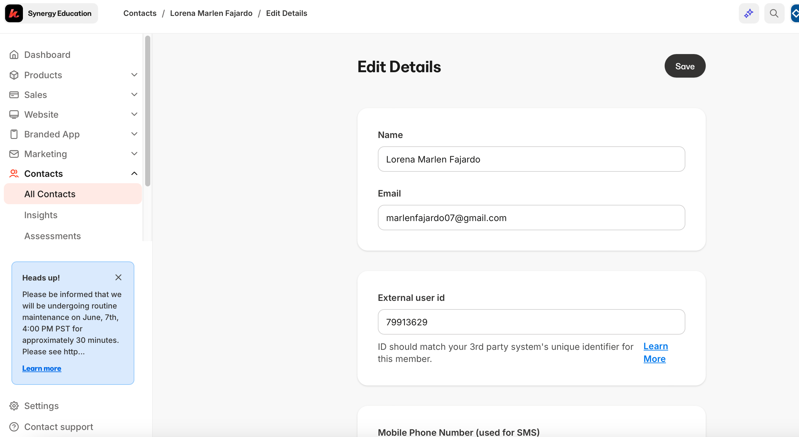

# Cambiar de titular

Los miembros durante su anualidad pueden cambiar de titular asignado para recibir el Club solo necesitan compartirnos lo siguiente:

1. Correo del miembro actual o número de teléfono
2. Buscarlo en atención y seguimiento, si no se encuentra pedirle comprobante de pago

Se cambia el titular de la base de datos de atención y seguimiento asi como de kajabi 

Ejemplo:

En la plataforma existe la opción de “Edit Details” hay que ingresar a ese apartado y cambiar el correo, nombre y número de teléfono 

Si el correo que nos comparten ya está suscrito a kajabi hay que borrarlo para después ponerlo en el perfil de usuario activo que desea el cambio de accesos 

*Se deja nota del cambio en notas de kajabi y en notas en el Excel de atención incluyendo los datos del propietario anterior y la fecha en la que se solicito el cambio