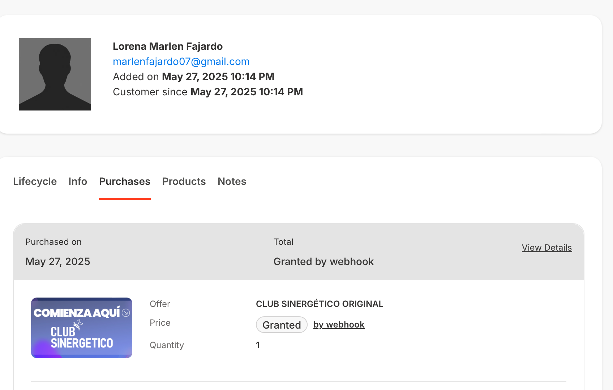
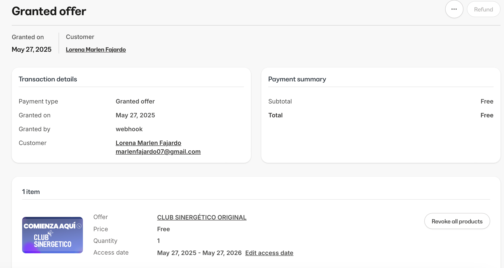

# Pausa en  membresía

Para los miembros que no pueden usar su membresía o que tienen otros cursos activos se les recomienda pausarla para que no se consuma el tiempo de su anualidad sin ingresar a los cursos 

Pasos:

1. Pedir correo del cliente
2. buscarlo en kajabi 
3. ir a purchases 
    
    
    
4. view details- revoke all products

    
    
    
5. Agregar a notas y atención y seguimiento cuando se solicito la pausa